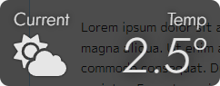

<h1>Chronidion</h1>

## 概要
シンプルな時計ウィジェットです。
ハイリア暦を表示できるアプリケーションが不思議なことに全く存在しなかったので、仕方なく自作しました。

半透明のウィンドウに時刻が表示されます。
ストップウォッチ機能や天気予報表示機能もあります。

  　

## 操作方法
### 共通
**[1]**: グレゴリオ暦による現在時刻を表示します。  
**[2]**: ハイリア暦による現在時刻を表示します。  
**[3]**: ストップウォッチを表示します。  
**[4]**: 現在の天気＋天気予報を表示します。  
**[F5]**: ウィジェットを画面右下へ移動します。  
**ドラッグ**: ウィジェットを移動します。

### 現在時刻の表示時
**[Z]**: 24 時間制と 30 時間制を切り替えます。

### ストップウォッチの表示時
**[Space]**: ストップウォッチの開始もしくは停止します。  
**[Backspace]**: ストップウォッチをリセットします。  
**[Z]**: 秒単位で表示するか 1/100 秒単位で表示するかを切り替えます。  
**[Q]**: 値に 1 時間増加させます。  
**[A]**: 値から 1 時間減少させます。  
**[W]**: 値に 1 分増加させます。  
**[S]**: 値から 1 分減少させます。  
**[E]**: 値に 1 秒増加させます。  
**[D]**: 値から 1 秒減少させます。

### 天気の表示時
**[Z]**: 現在の気温 (予報の場合は日中の気温) を表示します。  
**[X]**: 最高気温を表示します。  
**[C]**: 最低気温を表示します。  
**[V]**: 湿度を表示します。  
**[B]**: 降水確率を表示します。  
**[Q]**: 1 日前の予報を表示します。  
**[A]**: 1 日後の予報を表示します。