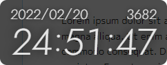
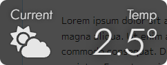

<div align="center">
<h1>Chronidion</h1>
</div>


## 概要
シンプルな時計ウィジェットです。
ハイリア暦を表示できるアプリケーションが不思議なことに全く存在しなかったので、仕方なく自作しました。

半透明のウィンドウに時刻が表示されます。
ストップウォッチ機能や天気情報表示機能もあります。

<div align="center">
  
  
</div>

## 注意点
天気情報の表示には OpenWeather の API を用いているいため、OpenWeather の API キーを別途取得して設定する必要があります。
何も設定せずにこのソースコードをビルドしたものや、GitHub Actions が自動ビルドしたものは、天気情報が表示されません。

天気情報を正しく表示するためには、このリポジトリをクローンし、ディレクトリトップに `variable.env` を作成し、以下の内容を書き込んでください。
```
WEATHER_KEY=(API キー)
```
その後、以下のコマンドを順に実行してください。
Windows 用以外の実行ファイルを作りたい場合は、下記の `windows` の部分を `mac` もしくは `linux` に変更してください。
```
npm install
npm run build
npm run pack:windows
```
ビルドが終わると、`product` フォルダ内に実行ファイルが生成されます。

## 操作方法
### 共通
**[1]**: グレゴリオ暦による現在時刻を表示します。  
**[2]**: ハイリア暦による現在時刻を表示します。  
**[3]**: ストップウォッチを表示します。  
**[4]**: 現在の天気＋天気予報を表示します。  
**[5]**: システム情報を表示します。  
**[F5]**: ウィジェットを画面右下へ移動します。  
**ドラッグ**: ウィジェットを移動します。

### 現在時刻の表示時
**[Tab]**: 24 時間制と 30 時間制を切り替えます。

### ストップウォッチの表示時
**[Space]**: ストップウォッチを開始もしくは停止します。  
**[Backspace]**: ストップウォッチをリセットします。  
**[Tab]**: 秒単位で表示するか 1/100 秒単位で表示するかを切り替えます。  
**[A]**: 値に 1 時間増加させます。  
**[Z]**: 値から 1 時間減少させます。  
**[S]**: 値に 1 分増加させます。  
**[X]**: 値から 1 分減少させます。  
**[D]**: 値に 1 秒増加させます。  
**[C]**: 値から 1 秒減少させます。

### 天気の表示時
**[↑]**: 1 日前の予報を表示します。  
**[↓]**: 1 日後の予報を表示します。  
**[Z]**: 現在の気温 (予報の場合は日中の気温) を表示します。  
**[A]**: 最低気温を表示します。  
**[Q]**: 最高気温を表示します。  
**[X]**: 湿度を表示します。  
**[C]**: 降水確率を表示します。